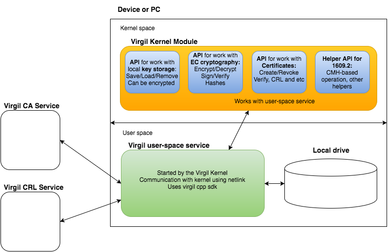
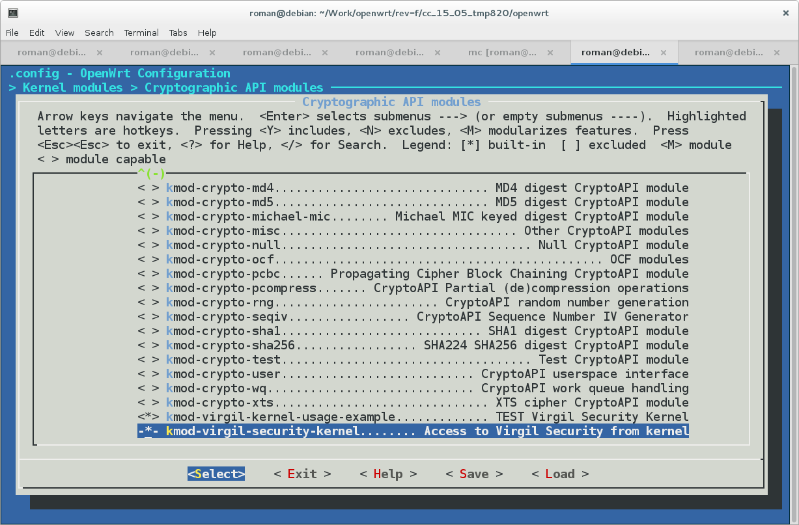

[](https://github.com/VirgilSecurity/virgil-kernel-module/blob/master/LICENSE)
[](https://virgilsecurity.github.io/virgil-kernel-module/)


# Virgil Kernel Module

<a href="https://d3js.org"></a>

The aim of this project is to provide possibility to use Eliptic Curve cryptography and Virgil Infrastructure inside of Linux Kernel. And also it provides helpers for IEEE1609.2  implementation.</br></br>

# Topics
* [General structure](#structure)
* [Build prerequisites](#build-prerequisites)
* [Build inside of OpenWrt](#build-openwrt)
[//]: # (* [Build module for current OS](#build-current-os))
* [API](#api)
	* [Crypto](#api-crypto)
	* [Certificates](#api-certificates)
	* [Key storage](#api-key-storage)
	* [Helpers for IEEE1609.2](#api-ieee1609.2)
* [Appendix A. Files used by Virgil Kernel Module](#appendix-files)
* [Appendix B. Create own credentials](#appendix-credentials)
* [License](#license)
* [Contacts](#contacts)

##<a name="structure"></a>General structure
System consists of next elements:

* Virgil Kernel Module
* User Space Service
* Virgil Services
	* Certificate Authority (CA)
	* Certificate Revocation List (CRL)

<a href="https://d3js.org"></a>

##<a name="build-prerequisites"></a>Build prerequisites

* Linux kernel version in 3.18.x
* Packages for kernel development
* CMake 3.1+

##<a name="build-openwrt"></a>Build inside of OpenWrt

### 1. Clone current repository
```shell
git clone https://github.com/VirgilSecurity/virgil-kernel-module.git
```

### 2. Clone OpenWrt 15.05
```shell
git clone git://git.openwrt.org/15.05/openwrt.git
```

### 3. Put make file of Virgil Kernel Module into OpenWrt build-tree
```shell
<virgil-kernel directory>/scripts/openwrt/openwrt-prepare.sh <path to OpenWrt>
```
Example:

```shell
~/virgil-kernel/scripts/openwrt/openwrt-prepare.sh ~/openwrt/
```

`openwrt-prepare.sh` will place Makefiles to build-tree of OpenWrt
and also replace CMake inside of OpenWrt (Use CMake 3.2).

### 4. Configure OpenWrt
```shell
make menuconfig
```
Select Virgil modules in Kernel modules/Cryptographic API modules. 

<a href="https://d3js.org"></a>

### 5. Make OpenWrt
```shell
make V=s
```

### 6. Install and prepare OpenWrt

* Install built OS
* Set root password
* Configure network and connect to internet

### 7. Install credential files
```shell
<virgil-kernel directory>/scripts/openwrt/openwrt-copy-test-credentials.sh <IP of device with OpenWrt>
```
Example:

```shell
~/virgil-kernel/scripts/openwrt/openwrt-copy-test-credentials.sh 192.168.0.100
```

### 8. Reboot and launch

* Reboot the device.
* Launch Virgil Kernel Module test in OpenWrt.

```
# insmod /lib/modules/<your version of kernel>/virgil-kernel-test.ko
```

[//]: # (##<a name="build-current-os"></a>Build module for current OS TODO:)

##<a name="api"></a>API

Doxygen documentation can be read [here](https://virgilsecurity.github.io/virgil-kernel-module/).

###<a name="api-crypto"></a>Crypto

* create key pairs
* encrypt 
	* using password
	* using private key
* decrypt data 
	* using password
	* using public keys
	* using certificates
* sign data using private key
* verify signature
	* using public key
	* using certificate

Encryption can be done for multiple recipients.

###<a name="api-certificates"></a>Certificates

* Get Root Certificate
* Create Certificate with custom data
* Verify certificate using Root Certificate
* Pull certificate from Virgil Service by identity
* Parse certificate (Get custom data and other elements of certificate)
* Revoke certificate
* Get Certificate Revocation List information
* Check whether certificate has been revoked

For certificate creation and revocation whole set of credential files should be present.
But for other operations only access token is required.<br>
More info is [here](#appendix-files).

###<a name="api-key-storage"></a>Key storage

There are two types of Key storage elements:

* permanent - data is saved to local storage file with limited size; 
* temporary - data is cached in memory only. And size of cache is limited too.

Available operations:

* Save/load key or certificate
	* can be used password-based encryption
* Remove key or certificate

###<a name="api-ieee1609.2"></a>Helpers for IEEE1609.2

Virgil Kernel Module contains helper functions for implementation of IEEE1609.2.

| IEEE1609.2 function | Virgil helpers |
|:---------------------------------------------------------------------------------------------------------------------:|:-----------------------------------------------------------------------------------------------------------------------------------------------------------------------------------------------------------------:|
| Sec-CryptomaterialHandle | int virgil\_ieee1609\_cmh\_create (cmh\_t * cmh) |
| Sec-CryptomaterialHandle-GenerateKeyPair | int virgil\_ieee1609\_cmh\_gen\_keypair<br>(cmh\_t cmh, int algorithm, data\_t * public\_key, data\_t * private\_key) |
| Sec-CryptomaterialHandle-StoreKeyPair | int virgil\_ieee1609\_cmh\_store\_keypair<br>(cmh\_t cmh, int algorithm, data\_t public\_key, data\_t private\_key) |
| Sec-CryptomaterialHandle-StoreCertificate | int virgil\_ieee1609\_cmh\_store\_cert<br>(cmh\_t cmh, data\_t certificate, data\_t priv\_key\_transform)<br><br>int virgil\_ieee1609\_transform\_private\_key<br>(data\_t private\_key, data\_t * priv\_key\_transform) |
| Sec-CryptomaterialHandle-StoreCertificateAndKey | int virgil\_ieee1609\_cmh\_store\_cert<br>(cmh\_t cmh, data\_t certificate, data\_t priv\_key\_transform) |
| Sec-CryptomaterialHandle-Delete | int virgil\_ieee1609\_cmh\_delete (cmh\_t cmh) |
| Sec-SymmetricCryptomaterialHandle | int virgil\_ieee1609\_cmh\_create (cmh\_t * cmh) |
| Sec-SymmetricCryptomaterialHandle-HashedId8 | int virgil\_ieee1609\_load\_key<br>(cmh\_t cmh, int key\_type, data\_t * loaded\_key)<br>int virgil\_hashed\_id8<br>(data\_t data, data\_t * hashed\_id8) |
| Sec-SymmetricCryptomaterialHandle-Delete | int virgil\_ieee1609\_cmh\_delete (cmh\_t cmh) |
| Sec-SignedData | int virgil\_ieee1609\_cmh\_sign<br>(cmh\_t cmh, data\_t data, data\_t * signature) |
| Sec-EncryptedData | int virgil\_encrypt\_with\_cert<br>(\_\_u32 recipients\_count,const data\_t * certificates,data\_t data, data\_t * enc\_data) |
| Sec-SecureDataPreprocessing | int virgil\_ieee1609\_get\_crl\_info (time\_t * last, time\_t * next)<br><br>int virgil\_ieee1609\_load\_key (cmh\_t cmh, int key\_type, data\_t * loaded\_key)<br><br>int virgil\_ieee1609\_request\_cert (cmh\_t cmh, data\_t * certificate); |
| Sec-SignedDataVerification | int virgil\_ieee1609\_verify\_cert (data\_t certificate, bool * is\_ok)<br><br>int virgil\_ieee1609\_load\_key<br>(cmh\_t cmh, int key\_type, data\_t * loaded\_key)<br><br>int virgil\_ieee1609\_request\_cert (cmh\_t cmh, data\_t * certificate); |
| Sec-EncryptedDataDecryption | int virgil\_ieee1609\_decrypt\_with\_cmh<br>(cmh\_t cmh, data\_t data, data\_t * decrypted\_data) |
| SSME-CertificateInfo | int virgil\_ieee1609\_parse\_cert<br>(data\_t certificate, kv\_container\_t * kv\_data, char ** geo\_scope,time\_t * last\_crl\_time, time\_t * next\_crl\_time, bool * is\_root\_cert) |
| SSME-AddTrustAnchor | int virgil\_ieee1609\_add\_cert (data\_t certificate, bool is\_root) |
| SSME-AddCertificate | int virgil\_ieee1609\_add\_cert (data\_t certificate, bool is\_root) |
| SSME-VerifyCertificate | int virgil\_ieee1609\_verify\_cert (data\_t certificate, bool * is\_ok) |
| SSME-DeleteCertificate | int virgil\_ieee1609\_delete\_cert (data\_t certificate) |
| SSME-Sec-ReplayDetection | No implementation |
| SSME-AddHashIdBasedRevocation | Used in User-space service |
| SSME-AddIndividualLinkageBasedRevocation | Used in User-space service |
| SSME-AddGroupLinkageBasedRevocation | Used in User-space service |
| SSME-AddRevocationInfo | Used in User-space service |
| SSME-RevocationInformationStatus | Used in User-space service |
| P2PCD | int virgil\_ieee1609\_load\_key<br>(cmh\_t cmh, int key\_type, data\_t * loaded\_key) |


##<a name="appendix-files"></a>Appendix A. Files used by Virgil Kernel Module


All Virgil Kernel Module files used by Virgil User-space Service. And files are located in `/root/`. 

* Credential files
	* .vtoken - contains Virgil Access Token. [Info](#appendix-credentials).
	* .vprivkey - Virgil Application Private Key. It is required only for certificates creation and revocation. [Info](#appendix-credentials).
	* .vpasswd - password for Virgil Application Private Key. It is required only for certificates creation and revocation. [Info](#appendix-credentials).
* .virgil-conf.ini - configuration file
	* CA - URL of Virgil CA Service
	* KEYS - URL of Virgil Keys Service
* .virgil-keys-cache.dat - container file with permanent Key Storage elements

##<a name="appendix-credentials"></a>Appendix B. Create own credentials

Repository contains test credentials. Located at : `integration/test-credentials`
It can be used for test purposes only.

To create credentials for your application you need to do:

* Go to [Virgil dev-portal](https://developer.virgilsecurity.com/account/signin).
* Sign In or Create account.
* Create application.
* After setting a password for key pair, save this password to file `_vpasswd`.
* Download saved keypair.
* Launch `<virgil-kernel directory>/scripts/helpers/get-private-key.sh <downloaded key-pair> > _vprivkey`<br> This will save Application's private key to file.
* Generate new token.
* Copy whole string with token and save to `_vtoken`.

Files `_vprivkey`, `_vpasswd` and `_vtoken` should be placed to `/root/` of PC or device with Virgil Kernel Module. And you need to replace `_` by `.` in file names.

##<a name="license"></a>License
BSD 3-Clause. See [LICENSE](https://github.com/VirgilSecurity/virgil-kernel-module/blob/master/LICENSE) for details.

##<a name="contacts"></a>Contacts
Email: <support@virgilsecurity.com>
